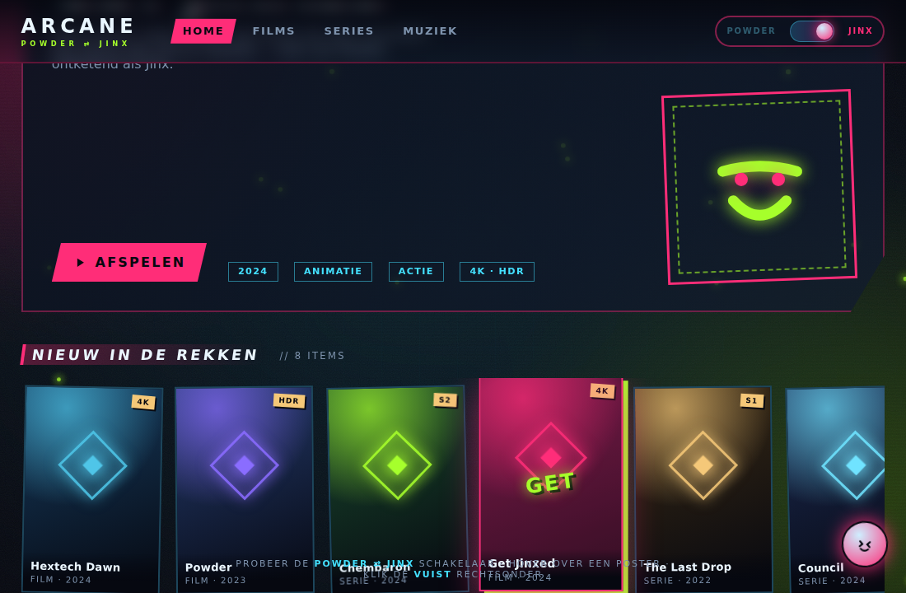
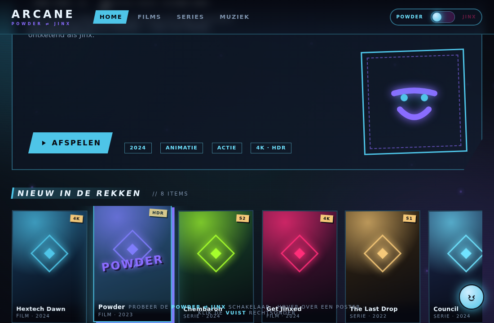

# Arcane: Powder ⇄ Jinx — Jellyfin thema

Eén thema, twee zielen. Geïnspireerd op Arcane en op Jinx' dubbele natuur:

- **Powder** — ingehouden, hextech-blauw, helder en strak
- **Jinx** — chaos: hot magenta + giftig chemtech-groen, glitch, scheve posters, graffiti

Geen plaatje-op-de-achtergrond cliché, maar een systematische neon-brutalist look: een levende chemtech-gloed met hex-raster achter alles, een glitchende paginatitel met chromatische aberratie, hextech-ruiten op de posters, afgeschuinde neon-knoppen, en hover-effecten met spuitbus-flits. Werkt als een serieuze, leesbare dark theme — maar met houding.

| Jinx | Powder |
|---|---|
|  |  |

*Dezelfde interface, één schakelaar. (Screenshots uit `mockup.html`.)*

## Eerst even zien: de mockup

Open **`mockup.html`** in je browser (dubbelklik, geen server nodig, geen internet nodig). Dat is een nep-mediabibliotheek die de hele look en alle animaties toont, inclusief:

- de **POWDER ⇄ JINX**-schakelaar rechtsboven (de kern van het thema)
- glitchend logo, chromatische titel, drijvende chemtech-deeltjes, scanlines
- posters met glitch-hover en een spuitbus-tag die indraait
- een detailoverlay met een hextech-kristal dat zich assembleert als laad-animatie
- een **Fishbones**-knopje rechtsonder (klik op eigen risico)

De mockup is puur om te showen; het echte thema is het CSS-bestand hieronder.

## Installeren in Jellyfin

### Stap 1 — het thema (CSS)

Plak in **Dashboard > Algemeen > Aangepaste CSS** deze regel:

```css
@import url("https://cdn.jsdelivr.net/gh/janco-kdg-ict/jellyfin@main/themes/arcane-jinx/jellyfin-arcane-jinx.css");
```

Of open `jellyfin-arcane-jinx.css`, kopieer de volledige inhoud en plak die rechtstreeks. Klik **Opslaan** en doe **Ctrl + F5**.

> Zet je naast deze regel ook eigen CSS, dan moet de `@import` helemaal **bovenaan** staan, anders negeert de browser hem.

Standaard staat **Jinx** aan.

### Stap 2 — de live-schakelaar (optioneel, maar dit is de showfeature)

Het Custom CSS veld accepteert geen JavaScript, dus de zwevende POWDER ⇄ JINX-knop komt uit een apart scriptje: `extras/arcane-toggle.js`. Het zet een class op de pagina die het palet omschakelt, en onthoudt je keuze.

**Optie A — Custom JavaScript plugin (aanbevolen, overleeft updates):**

1. Dashboard > **Plugins** > **Catalogus** > tandwiel (**Repositories**) > **+**
2. URL: `https://raw.githubusercontent.com/johnpc/jellyfin-plugin-custom-javascript/main/manifest.json`
3. Installeer **Custom JavaScript** uit de catalogus en herstart Jellyfin
4. Dashboard > **Plugins** > **Custom JavaScript**: plak de volledige inhoud van `extras/arcane-toggle.js` en sla op
5. **Ctrl + F5**

**Optie B — script-regel in index.html (geen plugin):**

Voeg op de server vlak voor `</body>` in de `index.html` van de webclient toe:

```html
<script src="https://cdn.jsdelivr.net/gh/janco-kdg-ict/jellyfin@main/themes/arcane-jinx/extras/arcane-toggle.js" defer></script>
```

(`/usr/share/jellyfin/web/index.html` op Debian/Ubuntu, `/jellyfin/jellyfin-web/index.html` in Docker, of `...\jellyfin-web\index.html` op Windows.) Een Jellyfin-update overschrijft dit bestand; optie A niet.

### Powder vast instellen zonder JS

Wil je permanent Powder en geen schakelaar: kopieer in `jellyfin-arcane-jinx.css` de waarden uit het `html.arcane-powder`-blok naar het `:root`-blok bovenaan.

## Kleuren aanpassen

Alle kleuren staan bovenaan `jellyfin-arcane-jinx.css` in het `:root`-blok:

| Variabele | Doet |
|---|---|
| `--c-1` | hoofdaccent (Jinx: magenta) — knoppen, borders, gloed |
| `--c-2` | tweede accent (Jinx: chemtech-groen) — voortgang, schaduwen |
| `--c-3` | derde accent (Jinx: cyaan) — subtekst, randen |
| `--glow` | kleur van de neon-gloed |
| `--chaos` | hoe scheef/wild alles staat (`0` = recht en kalm, `1` = vol Jinx) |
| `--bg-0/1/2` | achtergrond, panelen, kaarten |
| `--ink` / `--ink-dim` | tekst en subtiele tekst |

Tip: zet `--chaos` op `0.3` voor een rustigere versie met dezelfde kleuren.

## Wat zit er in deze map

| Bestand | Wat het is |
|---|---|
| `jellyfin-arcane-jinx.css` | het thema zelf, dit plak of link je |
| `mockup.html` | zelfstandige interactieve demo van de look en animaties |
| `extras/arcane-toggle.js` | optionele live POWDER ⇄ JINX-schakelaar voor de echte UI |

## Beperkingen, eerlijk

- Werkt in de **webinterface** (browser, desktop app, web-apps op mobiel). Native apps zoals **Android TV** en **Swiftfin** hebben hun eigen UI en negeren custom CSS én JavaScript.
- Geschreven voor **Jellyfin 10.9/10.10**; class-namen zijn geverifieerd tegen jellyfin-web 10.10.7. Een grote Jellyfin-update kan een detail breken — meestal een kleine fix.
- De achtergrond-gloed en glitch zijn pure CSS en kosten weinig; ze respecteren `prefers-reduced-motion` (animaties uit bij wie dat in z'n systeem aanzet).
- Niet gelieerd aan of goedgekeurd door Riot Games of Fortiche; een fan-thema, alleen kleuren en vormen, geen beeldmateriaal uit de serie.

## Terugdraaien

Custom CSS veld leegmaken, opslaan, Ctrl + F5. Voor de schakelaar: de geplakte JS uit de plugin halen (optie A) of de script-regel weghalen (optie B). Het thema raakt je bibliotheek of instellingen niet aan, het is puur uiterlijk.
